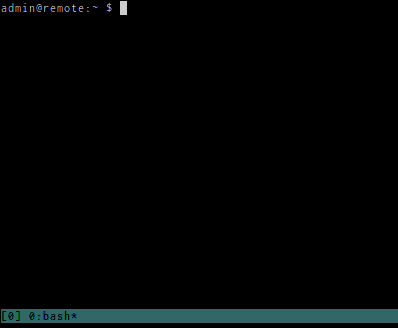

## About

[Tmux-logging](https://github.com/chilicuil/tundle-plugins/tree/master/tmux-logging) is a plugin for [Tundle](https://github.com/chilicuil/tundle) who enables logging and text screenshots on tmux.

<p align="center">

</p>

It's based on [tmux-plugins/tmux-logging](https://github.com/tmux-plugins/tmux-logging) with personal sauce and relaxed dependency requirements.

## Quick start

1. Add [tmux-logging](https://github.com/chilicuil/tundle-plugins/tree/master/tmux-logging) to your tmux  configuration (~/.tmux.conf):

   ```sh
   setenv -g @bundle "chilicuil/tundle-plugins/tmux-logging"
   ```

2. Install it:

   Hit `prefix + I` inside tmux (or run `~/.tmux/plugins/tundle/scripts/install_plugins.sh` for CLI lovers)

3. Enjoy ☺!

## Usage

### Key bindings

- `prefix + P` - toggle logging mode

   On logging mode, everything that's typed and all output will be saved to a file. Convenient for keeping track of your work.

- `prefix + alt + p` - take text screenshot

   All the text visible in the current pane is saved to a file. Like a screenshot, but textual.

- `prefix + alt + P` - save the whole tmux history

   Everything that has been typed and all the output since the creation of the current pane can be saved to a file.

- `prefix + alt + c` - clear the tmux history

For custom key bindings, add to `.tmux.conf`:

    setenv -g @logging-key               'P'
    setenv -g @screen-capture-key        'M-p'
    setenv -g @save-complete-history-key 'M-P'
    setenv -g @clear-history-key         'M-c'

### Configuration

Configuration is not required, but modifies the plugin behavior.

- Default directory to save files

        #options: string
        setenv -g @logging-path '$HOME'

        #options: string
        setenv -g @screen-capture-path '$HOME'

        #options: string
        setenv -g @save-complete-history-path '$HOME'

- Default base file name to where save files

        #options: string
        setenv -g @logging-filename 'tmux'

        #options: string
        setenv -g @screen-capture-filename 'tmux-screen'

        #options: string
        setenv -g @save-complete-history-filename 'tmux-history'

- Interactive mode, ask where to save files interactively

        #options: y|n
        setenv -g @logging-interactive 'n'

### External ansi sanitation programs

[ansifilter](http://www.andre-simon.de/doku/ansifilter/en/ansifilter.php) is a program specialized for removing (or working with) ANSI codes. When available tmux-logging will use it, otherwise it'll use sed(1).

## Also

* tmux-logging was developed against tmux 1.6 and dash 0.5 on Linux
* tmux-logging will try to run in as many platforms & shells as possible
* tmux-logging tries to be as [KISS](http://en.wikipedia.org/wiki/KISS_principle) as possible
